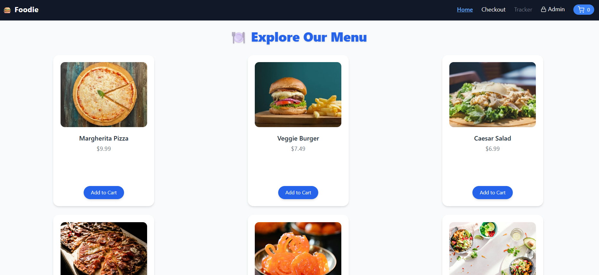
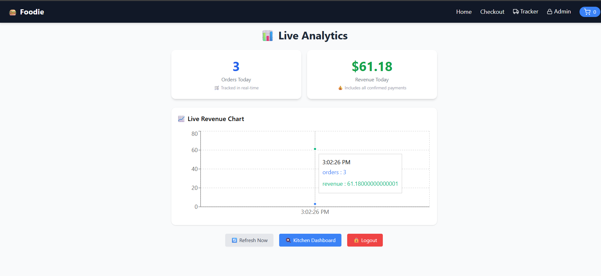
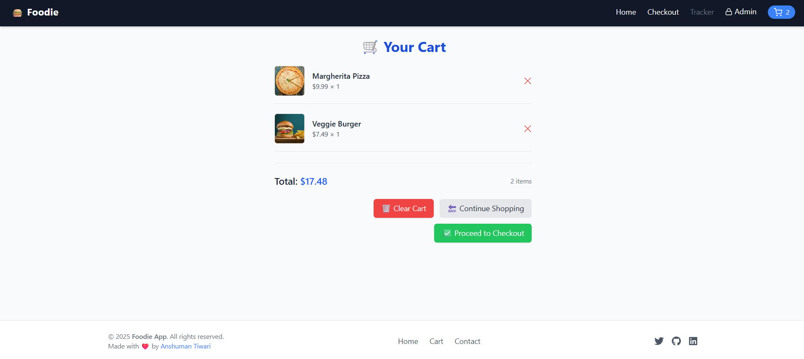

# 🍽️ Food Ordering Platform

A full-stack food ordering platform with real-time order tracking and kitchen management — built with:

- ⚛️ React 18 + Tailwind CSS (frontend)
- 🧠 Node.js + Express (backend)
- 🗄️ PostgreSQL + Knex (database)
- 🔌 WebSocket for real-time updates
- 📦 JSON-RPC 2.0 APIs
- 🐳 Docker + GitHub Actions (infra)

---

## ✅ Features (So Far)

### User-Facing
- 📄 Browse menu by category (loaded from DB)
- ➕ Add/remove items from cart (with quantity update)
- 🛒 Cart preview sidebar with animation
- 🔁 Cart persisted in `localStorage`
- 📋 Checkout form with validation
- 📦 Order confirmation screen
- 🚚 Real-time order tracking with live status updates (via WebSocket)

### Admin-Facing
- 🧑‍🍳 Kitchen dashboard: real-time view of active orders
- 🔄 Accept orders and update statuses (pending → cooking → out for delivery → delivered)
- 📊 Analytics page: orders & revenue today (live updates via WebSocket)
- 🔐 Protected routes for admin (`/kitchen`, `/analytics`) with logout

---

## ⚙️ JSON-RPC Methods

```js
getMenu({ since? })
placeOrder({ items, customer })
getOrderStatus({ orderId })
listOrders({ status?, limit? })
acceptOrder({ orderId })
updateOrderStatus({ orderId, status })
confirmPayment({ orderId, paymentRef })
```

### WebSocket Events:

```js
order_created
order_updated
analytics_update
```

---

## 🖼️ UI Preview

### 📋 Menu Page



### 📈 Analytics Dashboard



### Cart Page


---

## 📁 Project Structure

```bash
/frontend        # React + Tailwind app
/backend         # Express server, JSON-RPC, WS
/migrations      # DB schema via Knex
/docs            # Postman collection + UI screenshots
```

---

## 🔗 Deployment Links

- 🎯 Backend (Render): https://foodie-1-o9h9.onrender.com
- 🎥 Demo (Download): `demo/Demo-FoodieApp.mp4`
- 📺 Demo (Google Drive): [Watch Video](https://drive.google.com/file/d/1B1l4SvwecBSfWC7aZqkT5EFj4vxgkzGq/view?usp=drive_link)

---

## 🖼️ Additional Screenshots

All UI, Lighthouse scores, Docker run, Postman, and final views are available in the `/docs` folder.

Examples:

- `docs/ui-final-screens.png`
- `docs/lighthouse-score.png`
- `docs/docker-run-success.png`
- `docs/postman-tests.png`

---

## 🗓️ Progress Tracker

| Day     | Task                                      | Status    |
|---------|-------------------------------------------|-----------|
| Day 1   | Frontend scaffold                         | ✅ Done    |
| Day 2   | Menu, cart, sidebar                       | ✅ Done    |
| Day 3   | Checkout form & validation                | ✅ Done    |
| Day 4   | Backend scaffold & DB setup               | ✅ Done    |
| Day 5   | Core RPC methods                          | ✅ Done    |
| Day 6   | Tracker page + WS integration             | ✅ Done    |
| Day 7   | Kitchen dashboard + Analytics + Auth      | ✅ Done    |
| Day 8   | Dockerize & GitHub Actions CI             | ✅ Done    |
| Day 9   | Backend deployed on Render                | ✅ Done    |
| Day 10  | Docs, Lighthouse, Final push & Demo video | ✅ Done    |

---

## 💡 Redux Toolkit Rationale

I considered using Redux Toolkit during development, but decided not to include it in this version because:

- The app is currently small in scale, and using `useState`, `useEffect`, and `localStorage` has been sufficient for managing state.
- Real-time updates (like order tracking and analytics) are handled effectively through WebSocket, without needing global state.
- The codebase is modular, clean, and works well as-is — adding Redux at this point would add unnecessary complexity.

---

##  What about Zustand?

I also considered Zustand as a lightweight alternative for state management.

However, for this project, the built-in React hooks were enough to cover all state-related needs, so I avoided adding an extra dependency unnecessarily.

---

## 🔍 Note for Reviewers

I’m familiar with Redux Toolkit and Zustand, and I can implement either when the use case justifies it.  
For this project, I intentionally kept things lightweight and simple.

---

## 🚀 Getting Started Locally

### 1. Clone and setup backend

```bash
cd backend
npm install
npx knex migrate:latest
npm run dev
```

### 2. Run frontend locally

```bash
cd frontend
npm install
npm run dev
```

Or to serve final build:

```bash
npm run build
npx serve -s dist
```

---

## 📝 Notes

- Backend deployed successfully to Render.
- Frontend had deployment issues on both Render and Vercel due to vite permission problems. For now, demo recorded and attached instead.
- Docker setup partially worked — backend ran, but frontend build caused issues, so it's commented out in backend`src/index.js`.

---

## 🛠️ Technologies Used

| Tech             | Purpose                    |
|------------------|-----------------------------|
| React 18         | Frontend UI                 |
| Tailwind CSS     | Styling                     |
| Node.js + Express| Backend server & API        |
| PostgreSQL + Knex| Database + Migrations       |
| WebSocket        | Real-time order tracking    |
| JSON-RPC 2.0     | API structure               |
| Docker           | Containerization            |
| GitHub Actions   | CI/CD pipeline              |

---

## 🚧 Future Improvements (Optional)

- ✅ Deploy working frontend with Vite via custom Docker or Netlify setup
- 📱 Add mobile responsiveness and PWA support
- 💳 Integrate real payment gateway (Stripe, Razorpay, etc.)
- 📦 Pagination + filtering on order/admin lists


 
